# 삼복출프 (SBCP)

소규모 학원의 출결을 학생이 직접 체크하고, 집계된 결과를 AI가 주간 리포트 문장으로 옮겨 주는 웹 서비스입니다.

**배포 URL** — https://sbcp-attendance.vercel.app/

**GitHub** — https://github.com/Hoyasiro/sbcp-attendance

**서비스 기획서** — [docs/서비스기획서.md](docs/서비스기획서.md)

---

## 1. 서비스 소개

학원 원장이 매주 학부모에게 보낼 출결 리포트를 손으로 쓰는 일을 줄이는 것이 목적입니다.

- 학생이 2자리 번호로 등·하원을 직접 체크합니다
- 출석률·연속 출석·평균 체류 시간이 자동으로 집계됩니다
- **등급 판정은 JavaScript가 하고, AI는 그 결과를 문장으로 옮기기만 합니다**
- 학부모 발송용 / 학생 열람용 두 가지 톤으로 리포트를 생성합니다

### 설계 원칙 — 판정은 코드, 문장은 AI

같은 데이터로 몇 번을 생성해도 등급이 달라지면 안 됩니다.
그래서 출석률 계산과 등급 판정은 모두 코드가 처리하고,
AI에게는 확정된 등급과 숫자를 넘겨 **문장만 쓰게** 했습니다.

프롬프트에도 다음 규칙을 명시했습니다.

- 등급은 이미 정해져 있다. 절대 다시 판단하지 마라
- 숫자를 지어내지 마라
- 주어진 정보에 없는 이름·사실을 지어내지 마라

---

## 2. 화면 구성

| 화면 | 사용자 | 기능 |
|---|---|---|
| 출결 데스크 | 학생 | 번호 입력으로 등·하원 체크, 실시간 랭킹 TOP 3 |
| 학생 관리 | 원장 | 학생 등록·수정·삭제 |
| 데이터 관리 | 원장 | CSV 다운로드, 전체 백업·복구 |
| **주간 리포트** | 원장 | 주간 집계 + **AI 리포트 생성** |
| 설정 | 원장 | 학원 정보, 휴원일 관리 |

---

## 3. 기술 스택

| 영역 | 사용 기술 |
|---|---|
| 프론트엔드 | HTML / CSS / JavaScript (프레임워크 없음) |
| 백엔드 | Vercel Serverless Functions (Python) |
| AI | Google Gemini API |
| 데이터 저장 | 브라우저 localStorage |
| 배포 | Vercel (GitHub 연동 자동 배포) |

외부 패키지를 쓰지 않고 Python 표준 라이브러리(`urllib`)만으로 API를 호출합니다.

---

## 4. 폴더 구조

```
SBCP/
├─ index.html          진입 페이지 (5개 화면)
├─ css/style.css       스타일 + 반응형
├─ js/main.js          집계·판정·화면 제어
├─ api/report.py       Gemini 호출 (서버리스 함수)
├─ requirements.txt    의존성 (외부 패키지 없음)
├─ .gitignore          .env / .vercel 제외
├─ screenshot/         개발 과정 증빙
└─ docs/               서비스 기획서
```

`api/` 폴더의 파일명이 그대로 URL 경로가 됩니다. (`api/report.py` → `/api/report`)

---

## 5. 로컬 실행 방법

### 사전 준비

```bash
npm i -g vercel
```

확인 (개발 시 사용한 버전: Vercel CLI 59.10.0)

```bash
vercel --version
```

**Windows 사용자 주의** — Vercel CLI는 리눅스 기준으로 `python3` 명령을 찾습니다.
Windows에는 `python`만 있으므로, Python 설치 폴더에서 `python.exe`를
같은 위치에 `python3.exe`라는 이름으로 복사해 두어야 합니다.

### 실행

```bash
git clone https://github.com/Hoyasiro/sbcp-attendance.git
cd sbcp-attendance
vercel dev
```

브라우저에서 `http://localhost:3000` 접속.

> HTML 파일을 더블클릭해서 여는 방식(`file://`)이나 Live Server로는
> AI 기능이 동작하지 않습니다. `/api/` 경로를 처리할 서버가 없기 때문입니다.

---

## 6. 환경 변수 설정

이 서비스는 Gemini API 키가 필요합니다. **키는 코드에 적지 않고 환경 변수로만 관리합니다.**

| 변수명 | 설명 |
|---|---|
| `GEMINI_API_KEY` | Google AI Studio에서 발급받은 API 키 |

### 로컬

프로젝트 루트에 `.env` 파일을 만들고 아래와 같이 작성합니다.

```
GEMINI_API_KEY=YOUR_API_KEY_HERE
```

`.env`는 `.gitignore`에 등록되어 있어 저장소에 올라가지 않습니다.

### 배포 (Vercel)

`.env`가 저장소에 올라가지 않으므로, 배포 환경에는 키를 따로 등록해야 합니다.

1. Vercel 프로젝트 → **Settings → Environment Variables**
2. Key `GEMINI_API_KEY`, Value에 발급받은 키 입력
3. **Sensitive 토글을 켠 상태**로 저장 (저장 후 값을 다시 볼 수 없게 됩니다)
4. 재배포

> 환경 변수는 **배포 시점에 주입**됩니다.
> 값만 추가하고 재배포하지 않으면 기존 배포에는 반영되지 않습니다.

### 왜 환경 변수인가

- `js/main.js`에 적으면 브라우저가 파일을 통째로 내려받으므로 누구나 볼 수 있습니다
- `api/report.py`에 적으면 브라우저에는 안 보이지만, **공개 저장소에 그대로 노출**됩니다
- 환경 변수를 쓰면 코드에는 변수 이름만 남고, 실제 값은 코드 밖에 있습니다

---

## 7. 배포 방법

GitHub 저장소를 Vercel에 연결하면 `main` 브랜치에 푸시할 때마다 자동으로 재배포됩니다.

1. Vercel → **Add New → Project** → 저장소 선택
2. **Application Preset을 `Other`로 지정** ← 중요
3. Environment Variables에 `GEMINI_API_KEY` 등록
4. **Deploy**

> **2번이 중요한 이유**: `requirements.txt`가 있으면 Vercel이 Python 프레임워크
> 프로젝트로 감지하는 경우가 있고, 그러면 `api/` 폴더의 파일 기반 함수가
> 무시되어 API가 404가 됩니다. `Other`로 지정하면 이 문제를 피할 수 있습니다.
> 자세한 경위는 아래 개발 로그의 `[S6] vercel dev 502` 항목에 있습니다.

### 배포 확인 순서

프론트를 열어 보기 전에 백엔드부터 확인하면 문제 범위를 좁힐 수 있습니다.

```
https://sbcp-attendance.vercel.app/api/report
```

주소창에 직접 입력했을 때 **`501 Unsupported method ('GET')`** 이 나오면 정상입니다.
이 함수는 POST만 받으므로 GET을 거부하는 것이 올바른 동작입니다.
404가 나오면 함수 자체를 인식하지 못한 상태입니다.

---

## 8. AI 기능 명세

### 요청 / 응답

```
POST /api/report

요청  { "data": "출결 요약 텍스트", "tone": "parent" | "student" }
응답  { "ok": true,  "text": "리포트 문장" }
      { "ok": false, "error": "사용자에게 보여줄 안내 문구" }
```

성공과 실패를 같은 모양으로 돌려주기 때문에 프론트의 분기 코드가 단순해집니다.

### 데이터 흐름

```
[브라우저]
  번호 입력 → weeklyStats()로 집계·등급 판정 (JS)
           → 카드 4개 + 등급 배지 표시
           → buildReportData()로 AI에게 넘길 텍스트 생성
           → fetch('/api/report')
                    │
[Vercel Serverless Function] api/report.py
           → os.environ에서 키를 읽음
           → Gemini 호출 (timeout 25초, thinking_level: low)
           → 필요한 필드만 추려 JSON 반환
                    │
[브라우저]
           → renderReportText()로 화면에 표시
```

### 실패 처리

| 상황 | 화면 동작 | API 호출 |
|---|---|---|
| 번호 미입력 | 생성 버튼이 표시되지 않음 | 없음 |
| 미등록 번호 | "등록되지 않은 번호입니다" | 없음 |
| 이번 주 기록 0건 | "이번 주 출결 기록이 없습니다" | 없음 |
| 네트워크 끊김 | "연결에 실패했습니다. 네트워크 상태를 확인해 주세요." | 실패 |
| API 오류 (4xx/5xx) | 백엔드가 보낸 안내 문구 표시 | 실패 |
| 응답 지연 | 버튼이 "작성 중..."으로 바뀌고 안내 문구 표시 | 진행 중 |

외부 API의 원문 에러 메시지는 화면에 노출하지 않습니다.
개발자용 상세 원인은 `print()`와 `console.error()`로 분리했습니다.

### API 호출을 줄이기 위한 장치

AI API는 호출마다 과금이 발생하므로, 불필요한 호출을 네 겹으로 차단했습니다.

| 상황 | 호출 | 방법 |
|---|---|---|
| 빈 입력 · 미등록 번호 | ✕ | 버튼 숨김 + 입력 검증 |
| 이번 주 기록 0건 | ✕ | 집계 결과로 사전 판단 |
| 같은 조건 재요청 | ✕ | 2단 캐시 (메모리 + localStorage) |
| 요청 중 버튼 연타 | ✕ | 버튼·입력칸 잠금 |
| 데이터 또는 톤 변경 | ⭕ | 캐시 키가 달라짐 |

---

## 9. 동작 확인 결과

배포 URL 기준으로 확인한 결과입니다.

| 케이스 | 입력 | 결과 |
|---|---|---|
| 정상 입력 | `01` (출석 4/5) | 판정 "양호" + AI 리포트 표시 |
| 빈 입력 | (빈값) | 생성 버튼이 나타나지 않아 호출 경로 자체가 없음 |
| 미등록 번호 | `99` | "등록되지 않은 번호입니다" 표시, 카드·버튼 숨김 |
| API 오류 | 오프라인 상태 | "연결에 실패했습니다" 표시 |
| 재요청 | 같은 조건 반복 | 캐시에서 즉시 표시, 네트워크 요청 없음 |
| 반응형 | 375px | 사이드바가 하단 탭바로 전환, 가로 스크롤 없음 |

10. 운영 — API 키 유출 시 대응 절차

키가 코드·커밋·스크린샷 중 어디로든 외부에 노출되었다고 판단되면 아래 순서로 처리합니다.

순서가 중요합니다. 파일을 지우는 것보다 키를 폐기하는 것이 먼저입니다. 이미 공개된 키는 파일을 지워도 제3자가 이미 확보했을 수 있기 때문입니다. GitHub 공개 저장소에 올라온 API 키를 자동으로 수집하는 봇이 실제로 존재합니다.

1단계 — 즉시 키 폐기 및 재발급 (최우선)
Google AI Studio → API 키 관리 화면 접속
노출된 키를 삭제(폐기)
새 키를 발급

이 시점부터 노출된 키는 더 이상 호출에 사용할 수 없으므로 피해가 멈춥니다.

2단계 — 코드에서 제거
저장소 전체에서 키 문자열을 검색합니다
bash
git grep -n "GEMINI_API_KEY"
git grep -n "AIza"
git grep -nE "sk-|api_key|Bearer "
코드에 직접 적힌 값이 있으면 제거하고 os.environ.get() 방식으로 교체합니다
.gitignore에 .env가 등록되어 있는지 확인합니다
3단계 — 커밋 이력 정리

현재 파일에서 키를 지워도 과거 커밋에는 그대로 남아 있습니다. git log -p로 이력을 열면 누구나 볼 수 있습니다.

상황	처리
아직 push하지 않음	git reset으로 해당 커밋을 되돌린 뒤 다시 커밋
이미 push함	이력에서 해당 문자열을 제거해야 함 (git filter-repo 등)
이력 정리가 어려운 경우	저장소를 새로 만들어 현재 상태만 옮기는 방법도 있음

이력 정리는 협업 중이라면 다른 사람의 로컬 저장소와 충돌할 수 있으므로, 작업 전 팀에 공지하고 진행합니다.

4단계 — 새 키는 환경 변수로만
로컬: .env (.gitignore에 등록된 상태)
배포: Vercel → Settings → Environment Variables (Sensitive 토글 ON)
등록 후 재배포해야 반영됩니다
5단계 — 사용량 확인

Google AI Studio 대시보드에서 노출 기간 동안의 호출량과 과금을 확인합니다. 평소보다 급증한 흔적이 있으면 제3자가 사용한 것으로 판단합니다.

재발 방지
장치	내용
.gitignore	.env, .env.local, .vercel 등록
커밋 전 확인	git status에 .env가 잡히지 않는지 매번 확인
스크린샷	환경변수 입력 화면·터미널 토큰이 찍히지 않도록 촬영 전 확인
Sensitive 토글	Vercel에서 값을 다시 볼 수 없게 저장. 대시보드 캡처 시에도 안전
코드 리뷰	키 문자열 패턴(AIza, sk-, Bearer)을 커밋 전 검색
에러 문구 분리	외부 API 원문 에러를 화면에 노출하지 않음 (키 일부가 섞여 나올 수 있음)

이 프로젝트는 마지막 항목까지 반영되어 있습니다. 사용자에게 보여줄 문구는 백엔드가 직접 작성해 반환하고, 개발자용 상세 원인은 print()와 console.error()로만 남깁니다.

11. 확장 설계
11-1. AI 기능을 2개 이상으로 늘릴 경우

현재는 AI 기능이 1개(주간 리포트 생성)입니다. 예를 들어 "학부모 문의 자동 응답" 기능을 추가한다고 가정하면 변경 범위는 다음과 같습니다.

백엔드 — 엔드포인트를 파일 단위로 추가

Vercel Serverless Functions는 api/ 폴더의 파일명이 그대로 URL 경로가 됩니다. 따라서 기존 파일을 수정하지 않고 파일을 하나 더 만드는 것으로 끝납니다.

api/
├─ report.py     → /api/report    (기존: 주간 리포트)
└─ inquiry.py    → /api/inquiry   (신규: 문의 응답)

이 구조의 장점은 기능 간 격리입니다. 문의 응답 함수에 오류가 나도 리포트 생성은 영향을 받지 않습니다. 서버리스 함수는 요청마다 독립적으로 실행되기 때문입니다.

공통 코드가 늘어나면 다음 순서로 정리합니다.

두 파일에 같은 코드가 2회 반복되는 시점까지는 그대로 둔다
3회째 반복되면 api/_common.py 같은 파일로 추출한다 (Vercel에서 _로 시작하는 파일은 엔드포인트로 노출되지 않는 관례를 활용)
추출 대상 후보 — Gemini 호출 래퍼, 응답 파싱, 공통 에러 응답 포맷
프론트엔드 — 3분할 구조를 그대로 복제

현재 JS는 지침에 따라 역할을 셋으로 나눠 두었습니다.

collectReportInput()   입력 수집·검증
callReportApi()        API 호출
renderReportStats()    화면 렌더링
renderReportText()

기능이 늘어나면 이 세 칸을 기능별로 한 벌씩 더 만듭니다.

collectInquiryInput()  /  callInquiryApi()  /  renderInquiryText()

공통화할 부분과 그대로 둘 부분

대상	판단	이유
fetch 호출부	공통화	엔드포인트 경로와 본문만 다르고 나머지가 동일
캐시 로직	공통화	키 생성 규칙만 기능별로 다르게 주입
로딩·버튼 잠금 처리	공통화	대상 버튼 id만 인자로 받으면 됨
입력 검증	기능별 유지	검증 규칙이 기능마다 완전히 다름
렌더링	기능별 유지	출력 형태가 다름

예상 형태는 다음과 같습니다.

javascript
// 엔드포인트와 본문만 받아 처리하는 공통 호출 함수
async function callApi(endpoint, payload){
  var res = await fetch(endpoint, {
    method: 'POST',
    headers: { 'Content-Type': 'application/json' },
    body: JSON.stringify(payload)
  });
  return await res.json();
}

이 공통화가 가능한 이유는 백엔드의 응답 스키마를 처음부터 통일해 두었기 때문입니다. 모든 엔드포인트가 {ok, text} 또는 {ok, error} 형태로 반환하므로 프론트의 성공/실패 분기 코드를 그대로 재사용할 수 있습니다.

화면 구성

현재는 단일 페이지에서 화면을 전환하는 방식(goTab())입니다. 기능이 추가되면 사이드바에 항목을 하나 더 넣고 screen-inquiry 같은 화면을 추가합니다. 페이지 파일을 늘리지 않아도 되므로 라우팅 구조 변경이 필요 없습니다.

변경 범위 요약
파일	변경
api/inquiry.py	신규 생성
api/_common.py	공통 코드가 3회 반복될 때 신규 생성
index.html	사이드바 항목 1개, 화면 블록 1개 추가
js/main.js	기능별 3분할 함수 추가, callApi() 공통화
css/style.css	기존 클래스 재사용, 추가 최소
requirements.txt	새 패키지를 쓰지 않는 한 변경 없음
11-2. 사용량이 늘어날 경우

현재 규모(학원 1곳, 학생 수십 명)에서는 문제가 없지만, 사용자가 늘어나면 다음 순서로 대응합니다.

단계	상황	대응
1	같은 리포트를 반복 생성	적용 완료 — 클라이언트 캐시
2	여러 사용자가 같은 데이터를 조회	서버 측 캐시 도입 (현재 캐시는 브라우저별로 분리되어 있음)
3	응답 지연이 사용자 경험을 해침	스트리밍 응답으로 전환 (Vercel Python 런타임이 지원)
4	여러 학생 리포트를 한 번에 생성	요청을 큐에 넣고 백그라운드 처리 후 완료 알림
5	서버리스 실행 시간 한도 초과	작업을 쪼개거나 별도 워커로 분리

현재 단계에서 2~5를 미리 만들지 않은 이유 — 학원 1곳이 주 1회 사용하는 규모에서는 클라이언트 캐시만으로 충분하고, 구조를 복잡하게 만들면 유지보수 비용만 늘어납니다. 필요해지는 시점의 신호(응답 지연 체감, 쿼터 경고)를 기준으로 단계적으로 도입합니다.

11-3. 데이터 저장 방식이 바뀔 경우

현재는 브라우저 localStorage에 저장합니다. 단일 기기 사용을 전제한 선택입니다.

여러 기기에서 같은 데이터를 봐야 하는 상황이 오면 서버 저장소가 필요합니다. 그때의 변경 범위는 다음과 같습니다.

대상	변경
js/main.js의 save() / 로드 부분	localStorage 대신 API 호출로 교체
api/	데이터 CRUD 엔드포인트 추가
집계 함수 (weeklyStats 등)	변경 없음 — 입력 데이터 형태가 같으면 그대로 동작

집계 로직이 저장 방식과 분리되어 있어, 저장소를 바꿔도 판정 기준은 그대로 유지됩니다.

---

# 개발 과정 및 AI 코딩 도구 활용 로그

AI 코딩 도구와 함께 작업하면서 실제로 막혔던 지점과 해결 과정을 기록한 것입니다.
증빙 스크린샷은 `screenshot/` 폴더에 있습니다.

---

## [S3] CSS/JS 파일 분리 중 발생한 오류

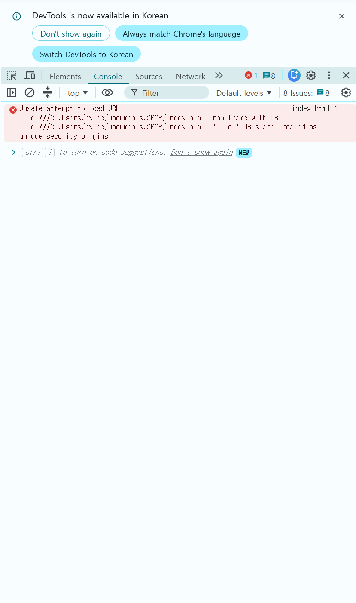

- **증상** — 파일 분리 후 사이드바 버튼이 동작하지 않음. `Uncaught ReferenceError: goTab is not defined`
- **추적** — Network 탭 확인 결과 `main.js`가 요청 목록에 **아예 없음**. 404가 아니라 목록에 없다는 것은 브라우저가 요청조차 하지 않았다는 뜻

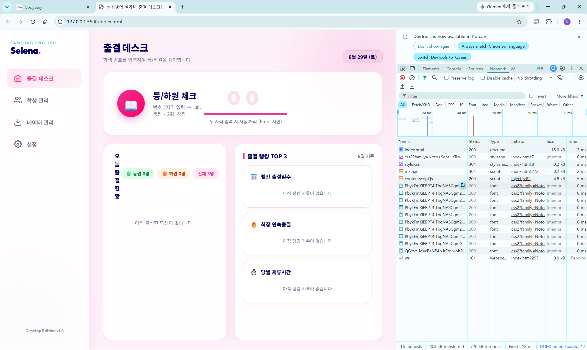

- **원인** — HTML에 `<script src="js/main.js">` 누락. 잘라내기 과정에서 빈 `<script></script>`만 남아 있었음
- **해결** — `<script src="js/main.js"></script>`로 수정

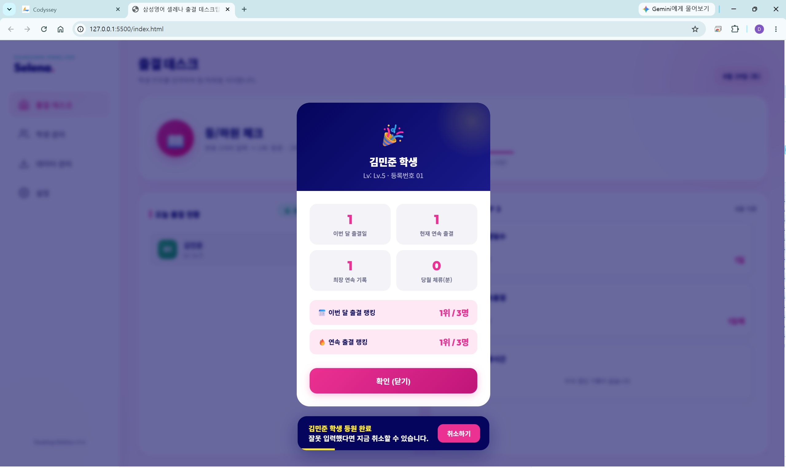

- **배운 점** — Console 에러는 증상, Network 탭은 원인. "파일이 404다"와 "파일을 요청도 안 했다"는 다른 문제다

---

## [S4] 모바일 레이아웃 전면 붕괴

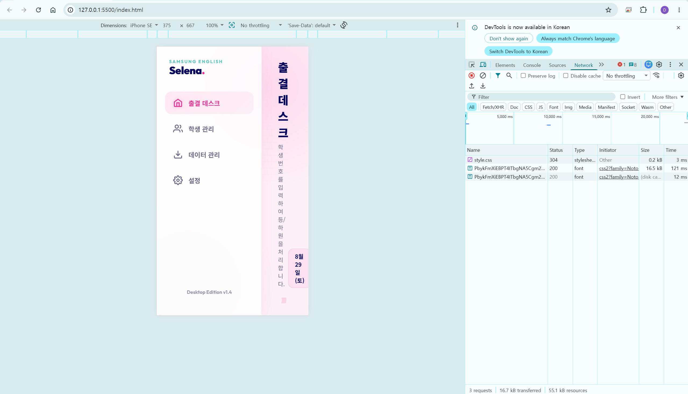

- **증상** — 375px에서 사이드바가 260px를 차지해 본문이 뭉개짐. 스크롤도 되지 않음
- **원인** — `@media` 쿼리가 0개. 스크롤 차단이 `body` / `.main-content` / `.screen` **3중으로** 걸려 있었음
- **해결** — `@media (max-width:768px)` 블록을 기존 CSS 아래에 추가. 사이드바를 하단 고정 탭바로 전환, 스크롤 3중 해제, 내부 그리드를 1열로

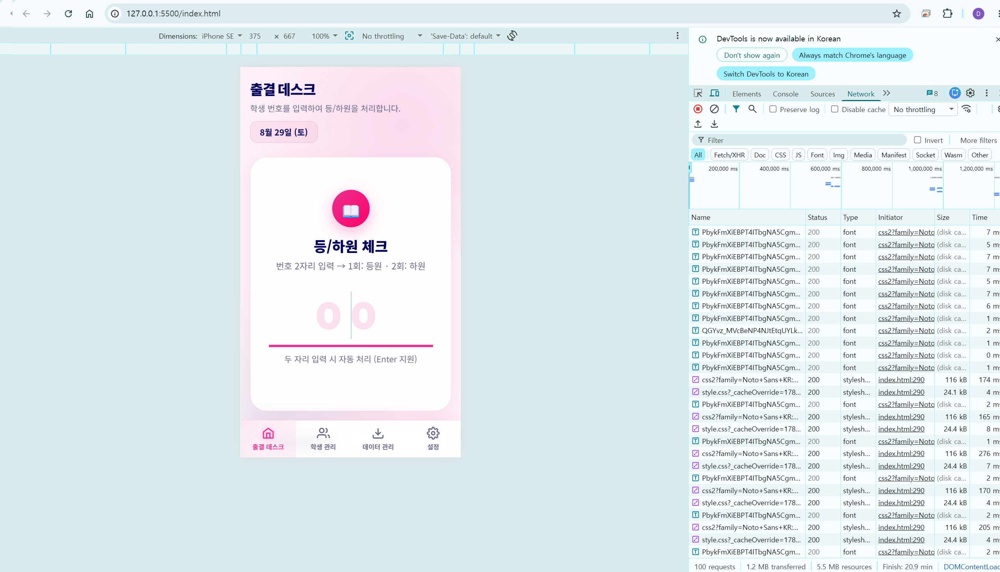

- **배운 점** — 기존 CSS를 고치지 않고 아래에 덮어쓰는 규칙만 추가하면 되돌리기 쉽다

---

## [S5] Gemini API 응답 구조 파악

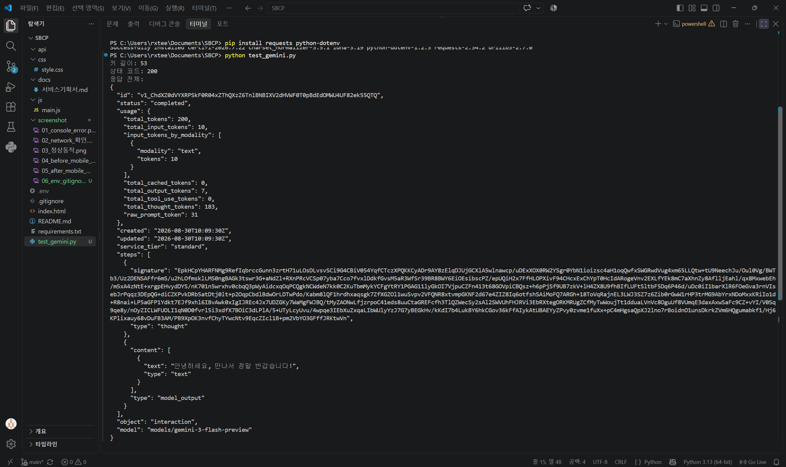

- **상황** — 공식 문서가 SDK 기준으로만 설명하고 REST 응답 JSON 예시를 제공하지 않음
- **시도** — AI Studio에서 코드 확인 → 요청 형식만 나오고 응답 형식은 없음
- **해결** — 임시 스크립트로 실제 호출한 뒤 응답 전체를 출력해 구조를 직접 확인
- **결과** — `steps[]` 배열에서 `type == "model_output"`인 항목의 `content[0].text`에 답변이 있음

```json
{
  "status": "completed",
  "steps": [
    { "type": "thought", "signature": "..." },
    { "type": "model_output", "content": [ { "type": "text", "text": "답변" } ] }
  ]
}
```

- **주의점** — 순서(`steps[1]`)로 찾으면 안 된다. thought 단계가 없는 경우가 있으므로 **`type`으로 찾아야** 한다
- **부수 발견** — 인사 한 문장에 thought 토큰 183개 소모. 출력 토큰 7개의 26배

---

## [S5] thinking_level 비교 후 low 확정

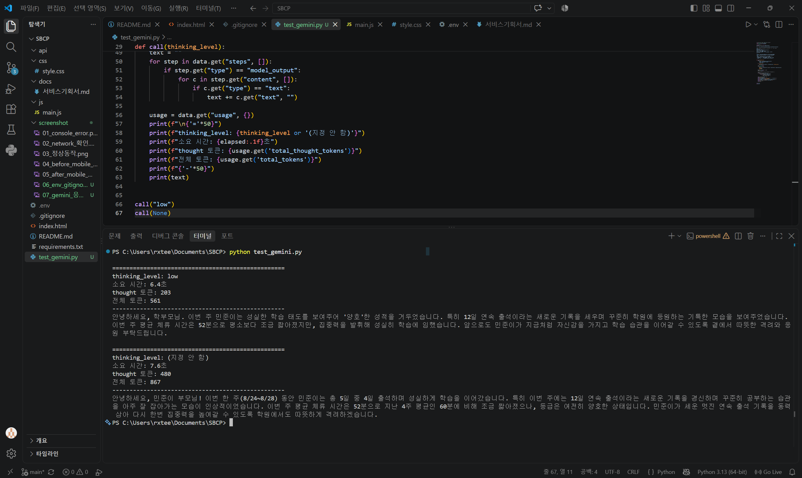

- **배경** — thought 토큰 과다 소모 확인 → 과금·속도 모두 불리
- **실험** — 동일한 출결 데이터·프롬프트로 `low` / 미지정 두 번 호출해 비교
- **결과** — 문장 품질에 유의미한 차이 없음
- **결정** — `thinking_level = "low"` 고정
- **근거** — 리포트 생성은 정해진 숫자를 문장으로 옮기는 작업이라 깊은 추론이 필요하지 않다고 판단

---

## [S5] vercel dev 로그인 실패 — ByteString 변환 오류

- **증상** — `Cannot convert argument to a ByteString because the character at index 0 has a value of 50724`
- **추적** — 50724가 유니코드 코드값임에 착안
  1. `$env:USERNAME` 확인 → `rxtee`, 영문이므로 무관
  2. `$env:COMPUTERNAME` 확인 → 한글 이름
  3. '오'의 코드값이 50724와 일치
- **원인** — CLI가 기기 이름을 HTTP 헤더에 담아 전송하는데, HTTP 헤더는 ASCII만 허용
- **1차 해결** — Vercel 토큰으로 로그인 단계를 우회. 토큰 입력 시 `Read-Host` 붙여넣기가 동작하지 않아 `Get-Clipboard`로 클립보드에서 직접 읽어 해결
- **최종 해결** — PC 이름을 영문으로 변경 후 재부팅 → 토큰 없이 정상 실행
- **배운 점** — 우회로를 만드는 것보다 원인을 제거하는 편이 빠를 때가 있다

---

## [S5] python3 명령을 찾지 못함

- **증상** — `uv is required ... python3 -m pip install ... Python was not found`
- **원인** — Windows는 `python`, 리눅스/맥은 `python3`. Vercel CLI가 리눅스 기준으로 `python3`를 찾음
- **해결** — `python.exe`를 같은 폴더에 `python3.exe`로 복사
- **배운 점** — 로컬(Windows)과 배포(Linux) 환경의 차이를 처음으로 체감한 사례

---

## [S5] requirements.txt 파싱 실패 — BOM 문제

- **증상** — `could not parse requirements.txt: Unexpected '癤'` → 내용을 고친 뒤에는 `Unexpected ''`
- **1차 시도** — 한글 주석이 원인이라 판단해 영문으로 변경 → 실패
- **재추적** — VS Code 상태바에 `UTF-8 with BOM` 표시 확인
- **원인** — PowerShell `Out-File -Encoding utf8`이 파일 앞에 BOM 3바이트를 삽입. 내용을 바꿔도 인코딩 설정은 유지되어 문제가 지속됨
- **해결** — VS Code에서 인코딩을 BOM 없는 UTF-8로 변경 후 저장
- **배운 점** — 눈에 보이지 않는 문자도 파일 내용이다. 에디터의 인코딩 표시를 확인하는 습관이 필요하다

---

## [S6] vercel dev 502 — requirements.txt가 프레임워크 감지를 유발

- **증상** — `.vercel` 재생성 과정에서 `NO_RESPONSE_FROM_FUNCTION`
- **시도 1** — `pyproject.toml`로 entrypoint 명시 → Windows 경로의 `\Users`를 파이썬이 유니코드 이스케이프로 해석해 `SyntaxError`
- **시도 2** — `pyproject.toml` 제거 → entrypoint를 찾지 못함 (양자택일 불가 상태)
- **재추적** — 처음 성공했던 시점의 조건과 비교 → 그때는 `requirements.txt`가 없었음
- **원인** — `requirements.txt`의 존재가 Python 프레임워크 감지를 유발. 프레임워크 프리셋이 잡히면 `api/` 폴더의 파일 기반 함수가 무시됨
- **해결** — `requirements.txt` 제거 후 프로젝트 재생성 → `No framework detected` 확인. 이후 파일을 복구해도 설정이 유지되어 정상 동작
- **배운 점** — 성공했던 시점과 지금의 차이를 비교하는 것이 유효한 디버깅 방법이다
- **후속** — 이 문제는 S7 배포 단계에서 다시 등장했고, Application Preset을 `Other`로 지정하는 것으로 더 간단히 해결했다

---

## [S6] 리포트 생성 오류로 판단했으나 정상 동작이었던 사례

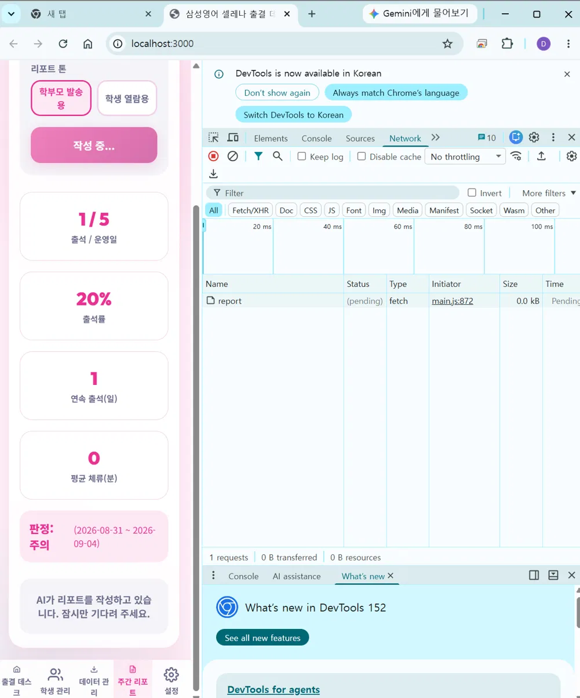

- **증상** — 리포트 생성 버튼을 누르면 오류가 난 것으로 보임
- **추적** — Network 탭에서 `report` 요청의 Status가 `(pending)`으로 표시됨
- **판단** — `(pending)`은 에러 코드가 아니라 **"요청을 보내고 응답을 기다리는 중"** 이라는 정상 상태. Gemini 응답에 시간이 걸리는 동안 이 상태가 유지되는 것이 맞음
- **결과** — 잠시 후 리포트가 정상 표시됨. 오류가 아니었음

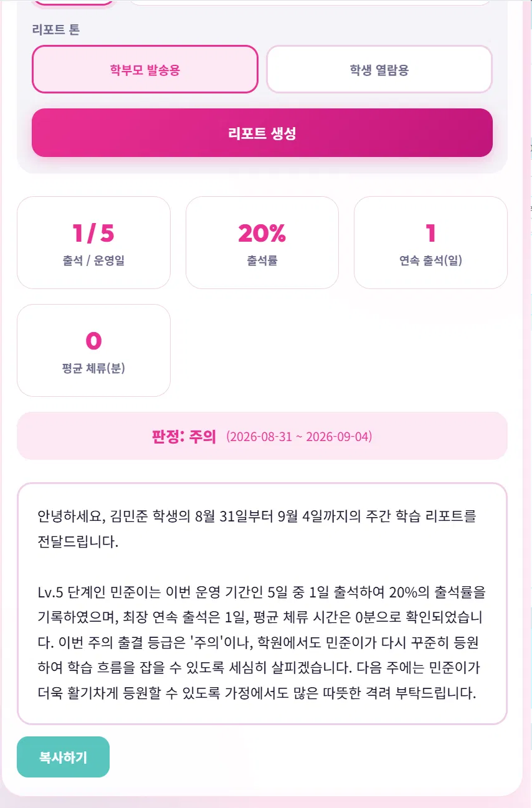

- **배운 점** — Network 탭의 표시를 상태 코드와 진행 상태로 구분해서 읽어야 한다. `(pending)` / `(failed)` / `404` / `500`은 각각 다른 의미다

---

## [S6] 빈 입력 처리 — 안내 대신 차단을 선택

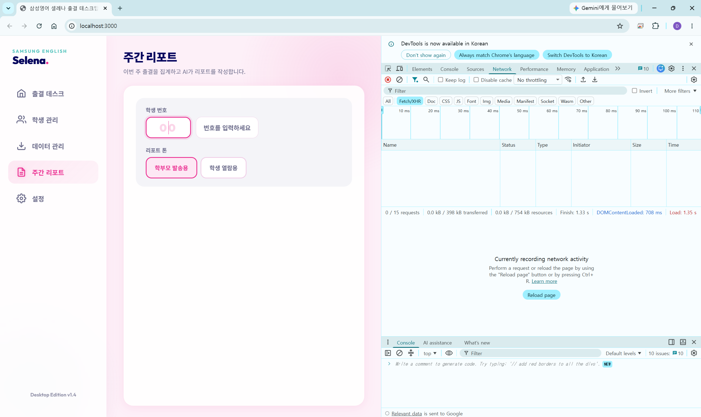

- **요구사항** — 빈 입력 시 사용자에게 안내를 제공하고 API를 호출하지 않을 것
- **1차 구현** — 버튼을 누르면 "학생 번호를 입력해 주세요." 메시지를 표시
- **변경** — 유효한 번호가 입력되기 전에는 생성 버튼 자체를 숨기도록 수정
- **근거** — 사용자가 실패를 경험한 뒤 안내받는 것보다, 애초에 실패할 수 없게 만드는 편이 낫다고 판단. 입력칸 옆의 "번호를 입력하세요" 표시가 안내 역할을 대신함
- **결과** — 빈 입력으로 API가 호출될 경로가 사라짐. Network 탭에 요청이 발생하지 않는 것으로 확인
- **주의** — 버튼을 숨겨도 Enter 키 경로가 남아 있으므로, 입력 검증 코드는 그대로 두었다

---

## [S6] API 오류 상황 재현

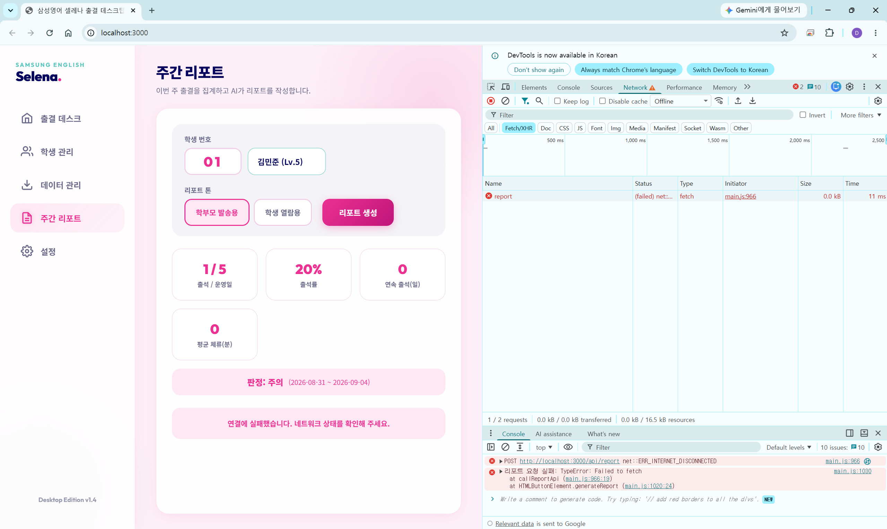

- **방법** — 개발자도구 Network 탭의 `Offline` 모드로 네트워크 차단
- **결과** — `report` 요청이 6ms 만에 `(failed)`로 종료. 화면에는 "연결에 실패했습니다. 네트워크 상태를 확인해 주세요." 표시
- **확인한 것** — 외부 API의 원문 에러 메시지가 화면에 노출되지 않는 것. 에러 문구에 키 일부가 섞여 나올 수 있으므로 사용자용 문구와 개발자용 로그를 분리했다

---

## [S6] 다른 학생의 집계 결과가 화면에 남는 문제

- **증상** — 01번 리포트를 생성한 뒤 번호를 02로 바꿔도, 화면의 집계 카드는 01번의 값이 그대로 남아 있음
- **원인** — 카드를 그리는 `renderReportStats()`를 호출하는 곳이 `generateReport()` 하나뿐이었음. 즉 카드는 **버튼을 눌러야만** 갱신되는 구조였고, 이름 표시만 입력 이벤트에 연결되어 있어 이름과 카드가 서로 다른 학생을 가리키는 상태가 발생
- **해결** — `refreshReportStats()`를 신설해 입력 이벤트에 연결. 다음 규칙을 코드로 고정
  - 카드는 항상 "지금 입력창에 있는 번호"의 것이어야 한다
  - 유효한 번호가 아니면 카드도 리포트도 남기지 않는다
- **부수 효과** — 버튼을 누르지 않아도 번호만 입력하면 집계가 표시되므로, 집계만 확인하고 싶을 때 API를 호출할 필요가 없어졌다
- **배운 점** — 화면에 보이는 값이 두 군데에서 따로 갱신되면 반드시 어긋나는 순간이 생긴다. 갱신 시점을 한 곳으로 모으는 것이 해법이었다

---

## [S6] 리포트 캐시 도입

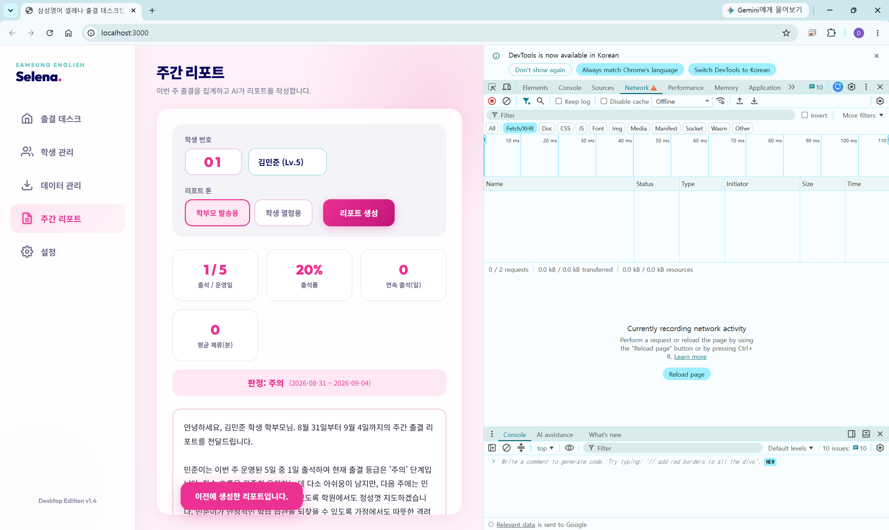

- **문제 인식** — 같은 학생, 같은 집계값, 같은 톤이면 AI에게 물어볼 내용이 동일한데도 버튼을 누를 때마다 매번 호출되고 있었음. 호출당 과금이 발생하고 응답에 20초 이상 걸리므로 개선 필요
- **설계** — 집계값 전체를 조합해 캐시 키를 만들고, 키가 있으면 저장된 문장을 재사용

```
키 = 학생ID | 주 시작일 | 출석일 | 운영일 | 연속 | 평균체류 | 등급 | 톤
```

- **키에 집계값을 모두 넣은 이유** — 학생이 추가로 출석하면 키가 달라져 자동으로 새로 호출된다. 데이터가 바뀌었는데 옛 리포트를 보여 주는 사고를 막기 위함
- **키에 톤을 넣은 이유** — 학부모용과 학생용은 문장이 달라야 하므로 다른 질문으로 취급해야 함
- **2단 구조** — 메모리(빠름, 새로고침 시 소멸) + localStorage(브라우저를 껐다 켜도 유지). 앱 시작 시 localStorage 내용을 메모리로 올려 두고, 조회는 메모리만 확인

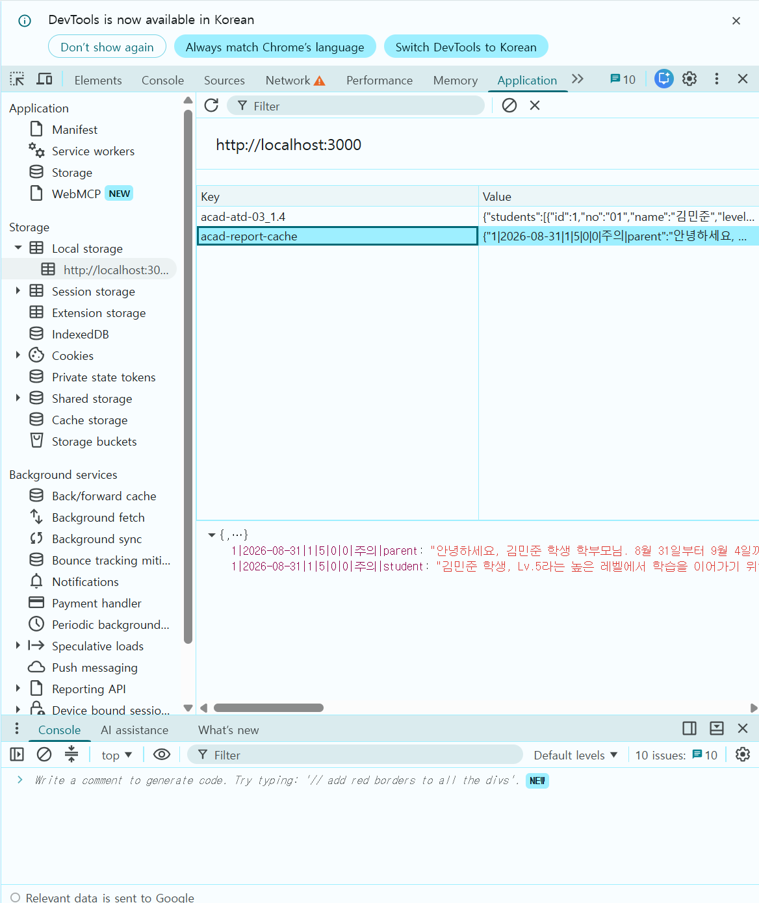

- **실패 결과는 저장하지 않음** — 에러를 캐시하면 네트워크가 복구된 뒤에도 계속 에러가 표시되기 때문

---

## [S6] 캐시 만료 기준을 '주 단위'에서 '학생+톤 단위'로 수정

- **최초 설계** — 주간 리포트이므로 지난주 항목만 삭제하도록 구현
- **문제 발견** — 같은 주 안에서도 학생이 추가로 출석하면 집계값이 바뀌어 이전 리포트가 무의미해짐. 그런데 "같은 주"라는 이유로 계속 남아 있었음
- **수정** — 학생ID + 톤 조합당 최신 1개만 유지하도록 변경
- **결과** — 주가 바뀌는 경우도 자동으로 처리되고, 저장 용량이 학생 수 × 2로 고정됨
- **배운 점** — 캐시를 만들 때는 "언제 버릴 것인가"를 "언제 재사용할 것인가"와 같은 비중으로 설계해야 한다

---

## [S6] 콘솔 경고 정리 — 에러와 잡음 구분하기

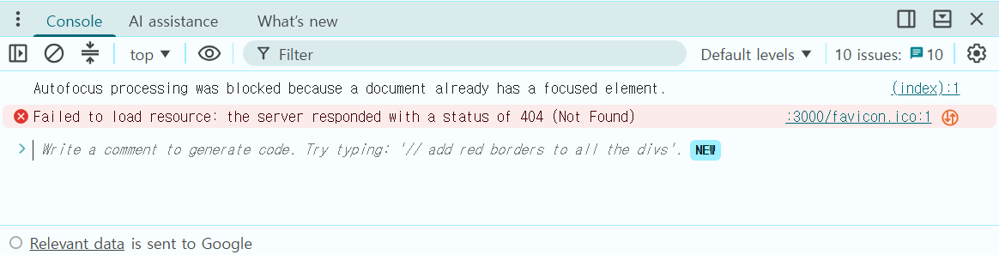

- **증상** — Console에 빨간 404와 노란 경고가 떠 있어 실제 에러를 구분하기 어려움
- **판단 1** — `favicon.ico` 404는 브라우저가 탭 아이콘을 찾으려고 **자동으로 요청**하는 것. 내 코드가 보낸 요청이 아니며 서비스 기능과 무관
- **판단 2** — `Autofocus processing was blocked` 경고는 HTML의 `autofocus` 속성과 JS의 `focus()` 호출이 중복되어 브라우저가 뒤엣것을 차단한 것
- **해결** — `<link rel="icon" href="data:,">`로 아이콘 요청을 차단 / `autofocus` 속성 제거로 중복 해소

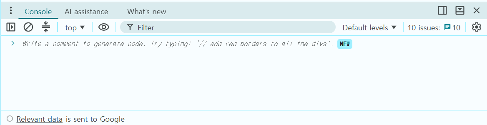

- **배운 점** — 콘솔의 빨간 줄이 모두 고쳐야 할 에러는 아니다. 요청 주체가 내 코드인지 브라우저인지부터 구분해야 한다

---

## [S6] 오프라인 테스트 중 캐시가 먼저 동작한 사례

- **증상** — API 오류 화면을 재현하려고 오프라인 모드로 전환했는데 리포트가 정상 표시됨
- **원인** — 캐시 조회가 `fetch`보다 앞에 있어 네트워크를 타지 않았음. 의도한 설계대로 동작한 것이지만 테스트 시나리오와 충돌
- **해결** — 톤을 변경해 캐시에 없는 조합을 만든 뒤 재현
- **배운 점** — 테스트를 설계할 때는 "무엇을 우회하고 있는지"를 알고 있어야 한다. 정상 동작이 테스트를 방해할 수 있다

---

## [S7] 배포 시 프레임워크 감지 문제 재발 방지

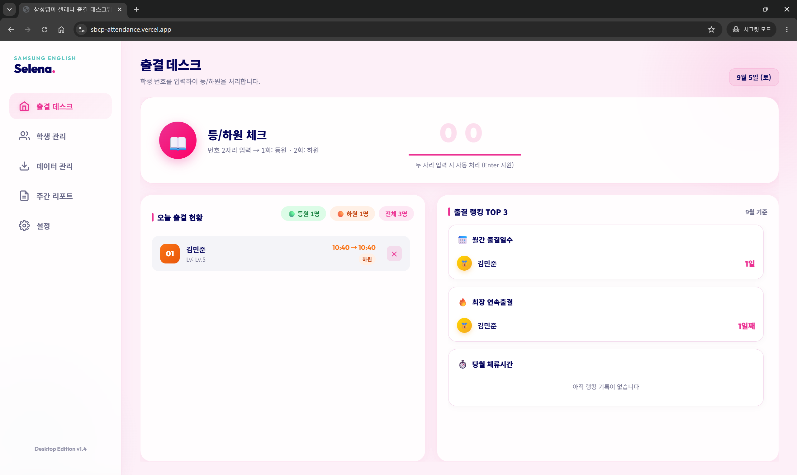

- **배경** — 로컬에서 겪은 `requirements.txt` → 프레임워크 감지 문제가 배포에서도 재발할 것으로 예상. 로컬에서는 파일을 잠시 치웠다가 프로젝트를 생성해 회피했지만, GitHub 연동 배포에서는 그 방법을 쓸 수 없음
- **확인** — 프로젝트 생성 화면에서 Application Preset이 실제로 `Python`으로 자동 감지되어 있었음
- **해결** — Preset을 `Other`로 변경한 뒤 배포
- **검증 순서** — 프론트를 열기 전에 `/api/report`를 주소창에 직접 입력. `501 Unsupported method ('GET')`이 반환되어 함수가 살아 있음을 먼저 확인
- **배운 점** — 로컬에서 오래 걸린 문제가 배포에서는 설정 하나로 해결되기도 한다. 그리고 프론트를 붙이기 전에 백엔드만 따로 확인하면 문제 범위가 자동으로 좁혀진다

---

## [S7] 주말에 평일 기준 집계를 검증할 수 없었던 문제

- **상황** — 배포 후 AI 기능을 검증하려 했으나, 테스트 당일이 토요일이라 출석을 기록해도 주간 집계에 반영되지 않음
- **원인** — 판정 기준상 대상 기간이 월~금이므로 `weekDays()`가 토요일을 운영일 배열에 포함하지 않음. 설계대로 동작한 것
- **혼란 지점** — 연속 출석은 1로 표시되는데 출석률은 0%로 나옴. 두 값의 출처가 달랐기 때문 (연속은 요일 무관한 누적 기록, 출석률은 이번 주 운영일 기준)
- **해결** — 직접 구현한 백업/복구 기능을 사용해, 이번 주 평일 날짜로 구성한 테스트 데이터를 JSON으로 만들어 불러옴
- **부수 검증** — 백업·복구 기능이 배포 환경에서도 정상 동작하는 것을 함께 확인
- **배운 점** — 날짜에 의존하는 기능은 테스트 시점에 따라 검증이 불가능할 수 있다. 데이터를 주입할 수 있는 경로를 미리 만들어 두면 이런 상황에서 쓸 수 있다

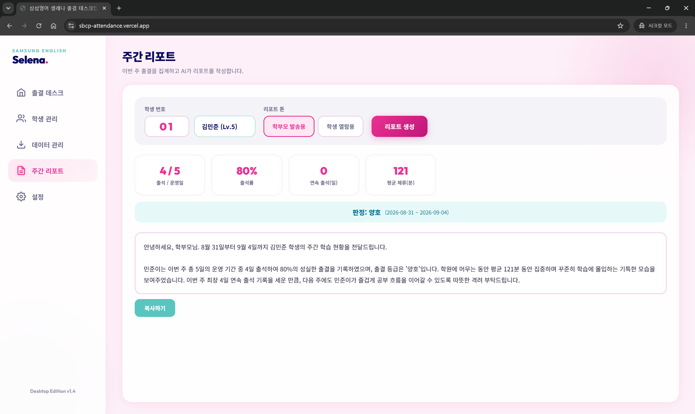

---

## [S7] 주간 평균과 월간 합계가 어긋나 보인 사례

- **증상** — 주간 리포트 카드에는 평균 체류 121분, 랭킹 화면에는 당월 체류 345분으로 표시되어 계산 오류를 의심
- **확인** — 두 값은 서로 다른 것을 세고 있었음

| 화면 | 값 | 대상 |
|---|---|---|
| 주간 리포트 카드 | 121분 | 이번 주 4일의 **평균** |
| 랭킹 | 345분 | 9월 한 달의 **합계** |

- **실제 원인** — 주간 평균은 `attendance` 원본에서 직접 계산되므로 정확했고, 월간 합계는 `stats`에 미리 저장해 둔 값이었는데 수동으로 만든 테스트 데이터의 값이 원본과 일치하지 않았음
- **배운 점** — 원본 데이터와 미리 계산해 둔 요약 데이터를 함께 두면 어긋날 수 있다. 이 프로젝트에 `recalcStatsForStudent()`처럼 원본에서 요약을 다시 만드는 함수가 필요한 이유가 여기에 있다

---

## 참고 — 반응형 확인

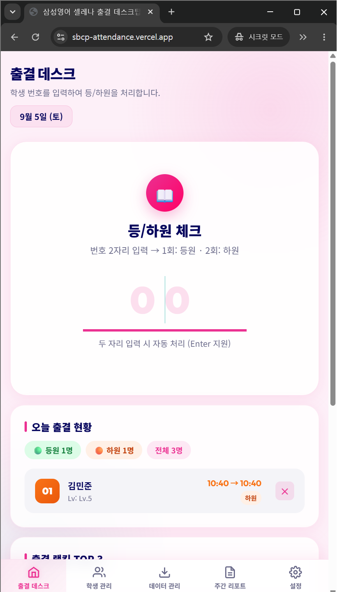

375px 기준으로 사이드바가 하단 탭바로 전환되고, 리포트 카드가 1열로 재배치되며,
가로 스크롤이 발생하지 않는 것을 확인했습니다.
